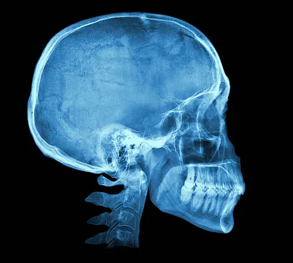

# X-NetMed, or: 
## *A Neural Network approach to pneumonia identification in X-rays images*

---
### The importance of a praecox diagnosis in pneumonia disease :

####
Pneumonia is inflammation and fluid in your lungs caused by a bacterial, viral or fungal infection. It makes it difficult to breathe and can cause a fever and cough with yellow, green or bloody mucus. The flu, COVID-19 and pneumococcal disease are common causes of pneumonia. Treatment depends on the cause and severity of pneumonia.
Not surprisingly many consider that chest radiology, which is a relatively inexpensive test, plays a fundamental and important role in the diagnosis of pneumonia, together with clinical assessment and sometimes appropriate microbiological testing. Its primary purpose is to diagnose or exclude pneumonia.
Certainly, in the case of patients admitted to hospital there is evidence that the early performance of a chest radiograph is associated with clinical benefit, including a significantly shorter hospital length of stay and antibiotic use after radiologyIt is possible for doctors to understand the presence of Pneumonia.
####
---
### Neural Network and Deep Learning to build a binary classifier to elaborate x-ray images :
####
The target of this project is to automatically verify the presence of a a pneumonia infection throught the analisys of the x-ray images of the patient's chest.
We used a Neural Network and a pretrained model that it is been adapted for our scopes.
The choosen pre-trained model it has been *ResNet50* from *keras* package.
The initial weights for the preprocess of the images has come from *imagenet*.
####
--- 
### Dataset :
####
The *dataset* that is been used for train our model come from *Keggle* and contains almost 6000 x-ray images splitted in *NORMAL* and *PNEUMONIA* classes:
[https://www.kaggle.com/datasets/paultimothymooney/chest-xray-pneumonia]
####
---
### Software architecture :
We decided to split the service in two separated function :
#### TF-Serving (*Model*) : 
This function needs a lot of GPU resources and its task consist into apply the *model* on the data provided from the *gateway* and send back the results.
#### *Gateway* :
This function get the input data from the user interface and pre-elaborate the image.
After this elaboration the *gateway-service* send the data to the *TF-Serving* and receive back the evaluation.
Once this function obtain the evaluation from the *TF-Serving*, the data are adjusted there in a post-elaboration and give back to the *user-terminal*.

---

### Repository content:
#### - notebook.ipynb file
This repository contains *notebook.ipynb file* : In this file we load the *ResNet50* model and the *dataset* downloaded from kaggle.
We worked on the *model* building on its top our specific *dense layer / inner layer* trained on the images loaded from our *dataset*.     
In the same file we tried different setup to obtain the best performance, tuning model parameters, as : *leraning_rate*, *drop_rate* and *augmentation*.
#### - ResNet50_v2_12_0.950.h5 file
We used the *keras.callbacks.ModelCheckpoint()* function to export the most performing model into the file: *ResNet50_v2_12_0.950.h5*.
#### - chest_xray-model folder
This is our final model format, we obtain it as output of method *tf_saved_model.save()*, applied to our *ResNet50_v2_12_0.950.h5* ; in this format it is compatible with *TF-Serving* service.
#### - image-model-dockerfile
This is the *docker* that we buil to apply the model.
We decided to have two separated services, one specialized in model application *model*, and another one that collect the requests from the client and provide to data elaboration pre and post evaluation *gateway*.
#### - tf-serving-connect.ipynb
Through this notebook we implemented the *gateway* service that provide image's pre-elaboration and send it to *image-model-dockerfile* that it is running to evaluate the x-ray chest images submitted.
#### - gateway.py
this is the convertion of the notebook *tf-serving-connect.ipynb* in a python script.
#### - Pipfile and Pipfile.lock
These files specify the dependencies that *gateway.py* script needs to install running in a virtual environment.
#### - proto.py
In this file we included the method *np_to_protobuf()*, this is the only method thatvwe need from *tensorflow* library.
In this way we can avoid to include in the project the huge *tensorflow* library (1.7Gb).
#### - image-gateway.dockerfile
This is the file to build the *docker* for the *gateway service*. We use this *dockerfile* to specify its parameters.
#### - test.py
This script provide the access at the diagnostic service, it loads the image url from the *user_terminal* and send it to the *gateway-service* receving back the image evaluation.
#### - docker-compose.yaml
This configuration file it is used to put the two docker in the same network and test the services using the *docker-compose* function.

---

### Running the project :
#### Get a copy of project and dependencies, or clone the repository :
```
git clone https://github.com/ISENBECK66/X-NetMed
```

---

# 1 - Docker TF-Serving, flask Gateway, test_local

---
##### Terminal_1 - TF-Serving (model) 
---

*TF-serving* Docker :
- Build docker:
```
docker build -t final-proj-model:resnet50-v2-001 -f image-model.dockerfile .
```
- Run docker:
```
docker run -it --rm -p 8500:8500 final-proj-model:resnet50-v2-001
```
---
##### Terminal_2 - GATEWAY SERVICE
---
Flask, gunicorn and virtual environment:
```
pip install pipenv
```
From the project's folder, run :
``` 
pipenv install
```
- All the dependencies should be automatically soddisfied, just verify.
- Run the local service using gunicorn inside the virtual environment:
```
pipenv run gunicorn --bind 0.0.0.0:9696 gateway:app
```
---
##### Terminal_3 - TEST_LOCAL
---
```
python test_local.py
```
Warning : the url of the image it is *hardcoded* in the script, if you want to eavluate another image please modify the script before to run it.

---
# 2 - docker-composer and Test
---
##### Terminal_1 - Docker-compose :
---
- Run the compose :
```
docker-compose up
```
---
##### Terminal_2 - Test :
---
```
python test.py
```
Warning : you need the url of a chest x-ray image to eavluate.
here there is a couple of url that can be tested : 
https://github.com/ISENBECK66/ML2023/blob/main/NORMAL2-IM-0132-0001.jpeg?raw=true - (NORMALE)
https://github.com/ISENBECK66/ML2023/blob/main/NORMAL2-IM-0135-0001.jpeg?raw=true - (NORMALE)
https://github.com/ISENBECK66/ML2023/blob/main/person3_virus_15.jpeg?raw=true - (PNEUMONIA)
https://github.com/ISENBECK66/ML2023/blob/main/person1_virus_11.jpeg?raw=true - (PNEUMONIA)
---
# 3 - Kubernetes 
